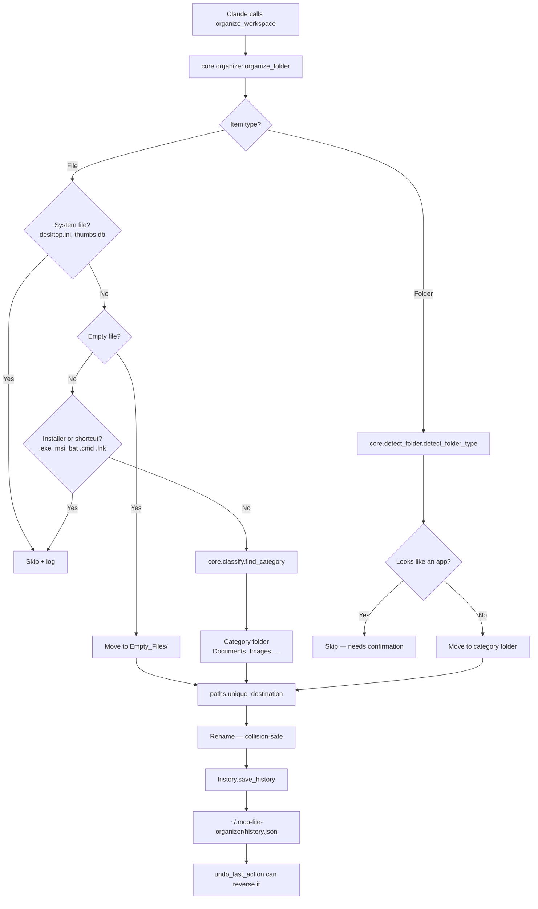

# MCP File Organizer

An MCP server that lets Claude organize your files for you — sort a messy folder by type, find duplicates, archive old files, move things around — with a safety guarantee most file tools don't offer: **it will not overwrite your files, it will not write outside your workspace, and you can undo every move it makes.**

Built for the people who don't organize their laptops. Not because they're lazy — because they're busy, and because the ten minutes it takes to sort a Downloads folder is ten minutes nobody has. Ask Claude to clean it up, and if you don't like the result, undo it.

---

## Why this exists (and why it looks the way it does)

I built the first version of this while learning how MCP servers actually work. It ran, it organized files, it did the job.

Then I audited it — properly, the way you'd audit code you didn't write — and found **thirteen real bugs.** Not style nits. Bugs like:

- Moving a file onto an existing file of the same name **silently destroyed the original.**
- A crafted path could make the server **write outside the workspace entirely.**
- The undo system handled exactly one action type out of six. The other five got **popped off the history stack and thrown away** — meaning the moment you tried to undo them, the record of what happened was gone forever, and the action became permanently unrecoverable.
- Undoing a folder move **wiped the entire history stack** in one call.
- A second, dead MCP server was **booting on every single startup**, silently, alongside the real one.
- Three tools moved files without recording anything, so they quietly weren't undoable at all.

Every one of those is fixed. This repo is the result of that work — fourteen commits, one bug at a time, with tests proving the important ones stay fixed.

I'm leaving this section in the README on purpose. A portfolio project that says "I built a thing and it works" tells you very little. A project that says "I built a thing, I didn't trust it, I audited it, and here's the evidence" tells you what I'll actually be like on your codebase.

---

## Safety guarantees

These are the properties the project is built around. Each one is enforced in code and covered by a test.

| Guarantee                                     | What it means                                                                                                                                                  | Enforced by                             |
| --------------------------------------------- | -------------------------------------------------------------------------------------------------------------------------------------------------------------- | --------------------------------------- |
| **No silent overwrites**                      | Moving `report.pdf` into a folder that already has a `report.pdf` produces `report(1).pdf`. The existing file is never touched.                                | `paths.unique_destination()`            |
| **No workspace escape**                       | Any path that resolves outside the workspace — `../`, absolute paths elsewhere — is rejected with `ValueError: Path escapes workspace`.                        | `paths.resolve_in_workspace()`          |
| **Every move is undoable**                    | Every tool that moves a file writes to a history stack. `undo_last_action` reverses them.                                                                       | `history.py`                            |
| **Undo never destroys what it can't restore** | If an action type can't be undone, the history entry **stays on the stack** and you get a clear error. It is never consumed and discarded.                     | `undo_last_action()`                    |
| **No dishonest undo**                         | `safe_delete` sends files to the OS Trash. It does **not** pretend `undo_last_action` can bring them back — because it can't. Recover from your Trash instead. | explicit branch in `undo_last_action()` |

### Honest caveats

Things the code genuinely does not do. Listed here rather than buried:

- **Bulk operations undo one file at a time.** `reset_workspace` on 40 files means 40 `undo_last_action` calls. Every file is recoverable — it's just not a single-click reversal.
- **`set_workspace` does not persist.** It changes the workspace for the running server only. Restart, and it returns to the default path.
- **`safe_delete` and `delete_duplicates` are not undoable in-app.** They move files to your OS Trash, which is recoverable — but through your file manager, not through this server.

---

## How it works



Every path that moves a file goes through `unique_destination()` and then writes to history. That's the whole design: **you cannot move a file through this server without it being both collision-safe and reversible.**

---

## Install

Requires **Python 3.12+**.

```bash
git clone https://github.com/Asaad-Suliman/MCP-file-organizer.git
cd MCP-file-organizer
uv sync
```

Run the server:

```bash
uv run python -m mcp_file_organizer
```

A clean start hangs silently waiting on stdin. That's success — it's an MCP server, it's waiting for a client. `Ctrl+C` to exit.

### Connect it to Claude Desktop

Add to your Claude Desktop config:

```json
{
  "mcpServers": {
    "file-organizer": {
      "command": "uv",
      "args": [
        "--directory",
        "/absolute/path/to/MCP-file-organizer",
        "run",
        "python",
        "-m",
        "mcp_file_organizer"
      ]
    }
  }
}
```

Restart Claude Desktop. The tools appear automatically.

### Paths

| What              | Where                                                   |
| ----------------- | ------------------------------------------------------- |
| Default workspace | `~/mcp-file-organizer-workspace` (created on first run) |
| State directory   | `~/.mcp-file-organizer/`                                |
| — undo history    | `~/.mcp-file-organizer/history.json`                    |
| — redo stack      | `~/.mcp-file-organizer/redo.json`                       |
| — saved rules     | `~/.mcp-file-organizer/rules.json`                      |
| — server log      | `~/.mcp-file-organizer/organizer.log`                   |

State lives **outside** the workspace on purpose — so organizing your workspace can never accidentally organize the server's own memory of what it did.

---

## Tool reference

27 tools. Legend: 🟢 read-only · 🔵 moves files, undoable · 🟠 requires confirmation · 🔴 destructive, not undoable in-app

### Inspect

| Tool                      | Params        | Does                                                                                     |
| ------------------------- | ------------- | ---------------------------------------------------------------------------------------- |
| 🟢 `ping`                 | —             | Liveness check.                                                                          |
| 🟢 `list_files`           | —             | Lists files in the workspace root.                                                       |
| 🟢 `list_subfolder`       | `folder`      | Lists files inside one workspace subfolder.                                              |
| 🟢 `search_files`         | `keyword`     | Case-insensitive search across the root and one level of subfolders.                     |
| 🟢 `find_duplicates`      | `mode="hash"` | Finds duplicates. `hash` = SHA-256 content match. `quick` = name + size. Detection only. |
| 🟢 `report_folder_stats`  | —             | File count and size per folder.                                                          |
| 🟢 `folder_health_report` | —             | Largest, oldest, newest files; size and age warnings.                                    |
| 🟢 `summarize_workspace`  | —             | High-level summary of the whole workspace.                                               |
| 🟢 `list_app_folders`     | —             | Detects app/installer folders by name or contents.                                       |
| 🟢 `preview_rules`        | —             | Dry run of `apply_rules`. Shows what would match. Changes nothing.                       |

### Organize

| Tool                      | Params                                      | Does                                                                                                                                                                   |
| ------------------------- | ------------------------------------------- | ---------------------------------------------------------------------------------------------------------------------------------------------------------------------- |
| 🔵 `organize_workspace`   | —                                           | The main one. Sorts loose files into category folders, and relocates subfolders by their dominant content type.                                                        |
| 🔵 `move_file`            | `filename`, `target_folder`                 | Moves one file into a subfolder.                                                                                                                                       |
| 🔵 `organize_all_folders` | —                                           | Moves every top-level folder into a category folder.                                                                                                                   |
| 🟠 `move_app_folder`      | `folder_name`, `target_category`, `confirm` | Moves one app folder. Requires `confirm="YES"`.                                                                                                                        |
| 🟠 `move_app_folders`     | `confirm`                                   | Moves all detected app folders into `Apps/`. Requires `confirm="YES"`.                                                                                                 |
| 🔵 `move_folder_back`     | `folder_name`, `original_path`              | Moves a folder out of the workspace to a path you specify. The one tool whose destination is deliberately unconstrained — leaving the workspace is its entire purpose. |
| 🔵 `move_duplicates`      | —                                           | Moves duplicate files into `Duplicates/` instead of deleting them.                                                                                                     |
| 🔵 `archive_old_files`    | `days=30`                                   | Moves files older than N days into `Archive/YYYY/Month/`.                                                                                                              |
| 🔵 `reset_workspace`      | —                                           | Moves every file back to the workspace root. Undoes an organize — one file at a time.                                                                                  |

### Rules

| Tool                | Params                                                         | Does                                                                                                                                       |
| ------------------- | -------------------------------------------------------------- | ------------------------------------------------------------------------------------------------------------------------------------------ |
| 🟢 `add_rule`       | `condition_type`, `value`, `action_type`, `target`, `priority` | Saves a rule. Touches no files.                                                                                                            |
| 🔵/🔴 `apply_rules` | —                                                              | Runs saved rules. A `move` action is undoable. A `safe_delete` action sends files to Trash **irreversibly** — check `preview_rules` first. |

### Undo

| Tool                   | Params | Does                                                                                           |
| ---------------------- | ------ | ---------------------------------------------------------------------------------------------- |
| 🔵 `undo_last_action`  | —      | Reverses the last move. Refuses — without consuming the entry — if the action can't be undone. |
| 🔵 `redo_last_action`  | —      | Reapplies the last undone move.                                                                |
| 🔵 `undo_folder_moves` | —      | Reverses all folder moves in history, newest first. Leaves other entry types untouched.        |

### Delete

| Tool                   | Params     | Does                                                                                                |
| ---------------------- | ---------- | --------------------------------------------------------------------------------------------------- |
| 🔴 `safe_delete`       | `filename` | Sends one file to the OS Trash. Recoverable from Trash, **not** via `undo_last_action`.             |
| 🔴 `delete_duplicates` | —          | Trashes all but the first copy of each duplicate. Prefer `move_duplicates` if you want it undoable. |

### Config

| Tool               | Params | Does                                                                           |
| ------------------ | ------ | ------------------------------------------------------------------------------ |
| 🟢 `set_workspace` | `path` | Points the server at a different folder. **Does not persist across restarts.** |

There is **no permanent-delete tool.** There was one. I removed it — an irreversible `unlink()` had no place in a project whose entire premise is that you can undo what it does. The OS Trash is a better answer.

---

## Project structure

```
src/mcp_file_organizer/
├── __main__.py           Entry point
├── mcp_server.py         All 27 MCP tool definitions
├── workspace_config.py   Workspace + state directory resolution
├── paths.py              unique_destination() · resolve_in_workspace()
├── history.py            Undo/redo stacks + the canonical action vocabulary
└── core/
    ├── categories.py     Extension → folder mapping
    ├── classify.py       find_category() — classifies files
    ├── detect_folder.py  detect_folder_type() — classifies folders
    └── organizer.py      organize_folder() — the real work

tests/
├── conftest.py           tmp_path-isolated fixture (never touches your real files)
└── test_organizer.py     Categorization · collision safety · path escape · undo/redo
```

## Tests

```bash
uv run pytest
```

Five tests, covering the properties that matter:

- a `.pdf` lands in `Documents/` — `test_pdf_moves_to_documents`
- a `.jpg` lands in `Images/` — `test_jpg_moves_to_images`
- a name collision produces `a(1).txt` and **leaves the original file's contents untouched** — `test_collision_produces_numbered_suffix`
- `../escaped.txt` raises `ValueError` and writes nothing outside the workspace
- move → undo → redo round-trips correctly, with exactly one entry on the redo stack

All tests run against a `tmp_path` fixture. Running the suite cannot touch your real workspace or your real history.

---

## Built with

`mcp` · `send2trash` · `pytest` · Python 3.12

## License

MIT — see [LICENSE](LICENSE).
